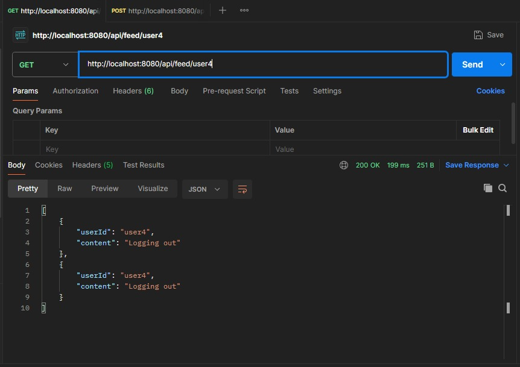
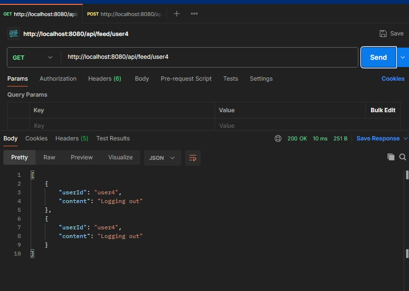
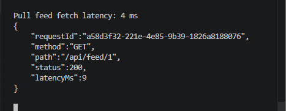
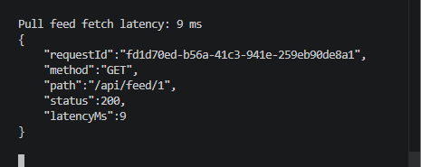
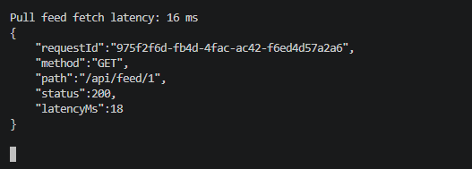
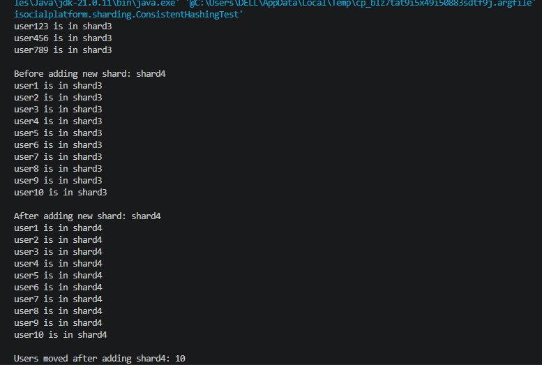

# Mini Social Platform

A production-inspired distributed social media backend built using Spring Boot, PostgreSQL, RabbitMQ, caching, feed fanout strategies, sharding simulation, observability, and asynchronous event-driven architecture.

---

# Tech Stack

- Java 21
- Spring Boot
- PostgreSQL
- RabbitMQ
- Spring JDBC
- Spring Data JPA
- JWT Authentication
- Maven

---

# Features

## Feed System
- Pull feed (fanout-on-read)
- Push feed (fanout-on-write)
- Hybrid feed architecture
- Ranked feed generation
- Celebrity-aware routing

## Distributed Systems
- RabbitMQ async processing
- DLQ handling
- Backpressure handling
- Idempotent consumers
- Circuit breaker
- Distributed tracing
- Consistent hashing
- Sharding simulation
- Replica simulation

## Security & Observability
- JWT authentication
- RBAC authorization
- Rate limiting
- Metrics endpoint
- Structured request logs
- Trace ID propagation

---

# High Level Architecture

```text
Clients
   │
   ▼
API Gateway
   │
   ▼
JWT Auth + Rate Limiter
   │
   ▼
App Servers
(FeedController + FeedService)
   │
   ├── Pull Feed Query
   │
   ├── Push Feed Cache
   │
   └── RabbitMQ Queue
            │
            ▼
     Feed Fanout Worker
            │
            ▼
    Notification Worker
            │
            ▼
      Shard Router
            │
    ┌───────┼────────┐
    ▼       ▼        ▼
 Shard1  Shard2   Shard3
    │       │        │
    ▼       ▼        ▼
 Replicas Replicas Replicas
```

---

# Setup Instructions

## 1. Clone Repository

```bash
git clone <your-repo-url>
cd mini-social-platform
```

---

## 2. PostgreSQL Setup

Create database:

```sql
CREATE DATABASE minisocialdb;
```

Configure `application.properties`:

```properties
spring.datasource.url=jdbc:postgresql://localhost:5432/minisocialdb
spring.datasource.username=postgres
spring.datasource.password=yourpassword
```

---

## 3. RabbitMQ Setup

RabbitMQ is used as the message broker for asynchronous event processing.

Download and run RabbitMQ:

```text
https://www.rabbitmq.com/download.html
```

Default configuration used:

```properties
spring.rabbitmq.host=localhost
spring.rabbitmq.port=5672
spring.rabbitmq.username=guest
spring.rabbitmq.password=guest
```

RabbitMQ dashboard:

```text
http://localhost:15672
```

Default credentials:

```text
username: guest
password: guest
```

---

## 4. Run Application

Start Spring Boot server:

```bash
.\mvnw.cmd spring-boot:run
```

Application runs on:

```text
http://localhost:8080
```

---

# APIs

## Signup

```http
POST /api/auth/signup
```

Body:

```json
{
  "username":"harsha",
  "password":"123456",
  "role":"USER"
}
```

---

## Login

```http
POST /api/auth/login
```

Body:

```json
{
  "username":"harsha",
  "password":"123456"
}
```

Response:

```json
{
  "accessToken":"...",
  "refreshToken":"..."
}
```

---

## Add Post

```http
POST /api/post
```

Request Body:

```json
{
  "content":"Hello World"
}
```

---

## Pull Feed

```http
GET /api/feed/pull/{userId}
```

Example:

```http
GET http://localhost:8080/api/feed/pull/1
```

---

## Push Feed

```http
GET /api/feed/push/{userId}
```

Example:

```http
GET http://localhost:8080/api/feed/push/1
```

---

## Hybrid Feed

```http
GET /api/feed/hybrid/{userId}
```

Example:

```http
GET http://localhost:8080/api/feed/hybrid/1
```

---

# Feed Models

## Pull Model
- feed generated during read
- lower write amplification
- higher read latency

## Push Model
- feed precomputed during post creation
- extremely fast reads
- higher storage usage

## Hybrid Model
- regular users use push
- celebrity users use pull
- balances scalability and latency

---

# Ranking System

Feed ranking score:

```text
score = recencyWeight + likeWeight
```

Features:
- configurable ranking
- engagement-aware ordering
- ranked top-20 feed

---

# Metrics Endpoint

```http
GET /metrics
```

Example Response:

```json
{
  "totalRequests": 12,
  "averageLatencyMs": 45
}
```

Structured request logs are generated for every request.

Example:

```json
{
  "requestId":"abc123",
  "method":"POST",
  "path":"/api/post",
  "status":200,
  "latencyMs":45
}
```

---

# Running Benchmark

Runs LRU vs LFU benchmark with an 80/20 skewed access pattern.

```bash
.\mvnw.cmd exec:java "-Dexec.mainClass=com.social.minisocialplatform.benchmark.CacheBenchmark"
```

---

# Running Request Coalescing Load Test

Simulates 100 concurrent requests hitting the same cold cache key.

```bash
.\mvnw.cmd exec:java "-Dexec.mainClass=com.social.minisocialplatform.benchmark.CoalescingLoadTest"
```

Observed behavior:
- only one request fetches from database
- remaining requests wait and reuse cached data

---

# Cache Latency Comparison

| Scenario | Latency |
|---|---|
| Cache Miss (First Request) | 191 ms |
| Cache Hit (Second Request) | 10 ms |

### Cache Miss (First Request)


### Cache Hit (Second Request)


The first request fetches data from PostgreSQL and populates the cache.
Subsequent requests are served directly from the in-memory LRU cache.

---

# Pull Feed Latency Benchmark

| Followers | Latency |
|---|---|
| 10 | 4ms |
| 100 | 9ms |
| 1000 | 16ms |

### 10 Followers


### 100 Followers


### 1000 Followers


---

# Push vs Pull Feed Comparison


---

# Hybrid Feed Ranking


---

# Consistent Hashing and Shard Redistribution



---

# PostgreSQL Migration

The project replaces flat-file storage with PostgreSQL.

Implemented:
- relational schema
- indexed queries
- JDBC integration
- optimized feed queries

Database tables:
- users
- posts
- follows
- likes

---

# Database Indexing

Added indexes:

```sql
CREATE INDEX idx_posts_user_id ON posts(user_id);
CREATE INDEX idx_posts_created_at ON posts(created_at);
CREATE INDEX idx_follows_follower_id ON follows(follower_id);
```

---

# Query Optimization

## Before Indexing

Query used sequential scan.


---

## After Indexing

Query used bitmap index scan.


---

# Distributed Tracing

Request IDs are propagated through asynchronous RabbitMQ workers.

Flow:

```text
HTTP Request
↓
RequestLoggingFilter generates requestId
↓
Trace ID attached to event
↓
FeedFanoutWorker receives trace ID
↓
NotificationWorker receives trace ID
```

This enables end-to-end tracing across async services.

---

# Failure Handling

Implemented:
- Circuit breaker
- Dead Letter Queue (DLQ)
- Backpressure handling
- Load shedding
- Cache invalidation
- Request coalescing

Example:

```text
Current pending events in feed worker: 6
Backpressure triggered. Dropping event
```

---

# Key Concepts Implemented

- Pull, Push, Hybrid feed fanout
- RabbitMQ async processing
- JWT auth + RBAC
- Rate limiting
- Caching and request coalescing
- Sharding and replication simulation
- Distributed tracing
- DLQ and backpressure handling

---

## Documentation

- docs/07-caching.md — Adding caching to Instagram-style feed system
- docs/08-db-choice.md — Database selection and ER design decisions
- docs/08-ecommerce-db.md — E-commerce relational database design
- docs/09-sharding-decisions.md — Sharding strategies and partitioning trade-offs
- docs/09-user-storage.md — Scalable user storage architecture for 100M users
- docs/10-order-processing.md — Distributed order processing system design
- docs/11-secure-login.md — Secure JWT authentication, RBAC, rate limiting, tracing, and observability
- docs/12-feed-hld.md — Designing the Twitter/Instagram feed HLD

---

# Future Improvements

- Redis distributed cache
- Kafka event streaming
- ML-based ranking
- Docker Compose
- Kubernetes deployment
- AWS/GCP deployment